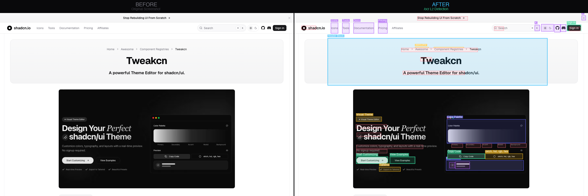
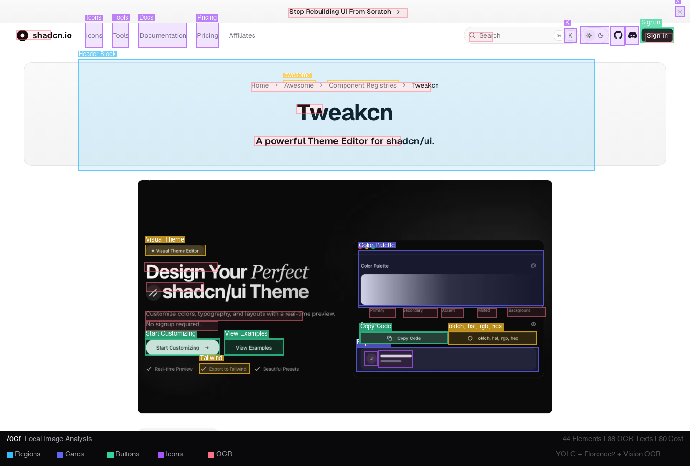

# /ocr — 로컬 이미지 분석 도구

> **[English Documentation](../README.md)**

이미지를 로컬에서 분석하여 구조화된 Markdown 텍스트를 생성합니다.
Claude Code 스킬(`/ocr`)로 설계되어, LLM에 이미지를 첨부하지 않고도 이미지 정보를 이해할 수 있습니다.

## 왜 필요한가?

LLM에 이미지를 직접 첨부하면 이미지당 ~$0.01-0.04의 비용이 발생합니다.
이 도구는 이미지를 **로컬에서** 분석하고 구조화된 텍스트를 출력하여 **비용 $0**으로 동일한 효과를 냅니다.

### Before / After

<p align="center">
  
</p>

> 왼쪽: 원본 스크린샷 | 오른쪽: `/ocr` L2 디텍션 — UI 요소 44개 + OCR 텍스트 38개 로컬 추출

<p align="center">
  
</p>

### 토큰 & 비용 비교

실제 스크린샷은 **Retina/4K 해상도**입니다. MacBook Pro 14"에서 `Cmd+Shift+3`하면 3024×1964px — 이미지 한 장에 **2,125 토큰**, 매 턴마다 재전송됩니다.

| 기기 | 해상도 | Vision API 토큰 | 10턴 대화 비용 (Opus) | /ocr |
|------|--------|----------------|---------------------|------|
| MacBook Pro 14" (Retina) | 3024×1964 | 2,125 | $0.319 | **$0** |
| MacBook Pro 16" (Retina) | 3456×2234 | 2,635 | $0.395 | **$0** |
| Dell 4K 모니터 | 3840×2160 | 2,635 | $0.395 | **$0** |
| iMac 24" (Retina 4.5K) | 4480×2520 | 4,165 | $0.625 | **$0** |
| Windows FHD | 1920×1080 | 1,105 | $0.166 | **$0** |

**월간 비용** (하루 20장 × 30일):

| 모델 | Vision API | /ocr | 절감률 |
|------|-----------|------|--------|
| Claude Opus | **$19.12** | $0 | 100% |
| Claude Sonnet | **$3.83** | $0 | 100% |
| GPT-4o | **$4.78** | $0 | 100% |

`/ocr`은 어떤 해상도든 **~600 토큰의 구조화된 Markdown**으로 변환합니다. context에 이미지 토큰 없음, 매 턴 재과금 없음, context window 오염 없음.

## 3계층 하이브리드 파이프라인

| 계층 | 분석 내용 | 속도 | 모델 크기 | 비용 |
|------|----------|------|-----------|------|
| **L1** (항상 실행) | OS OCR + 색상 분석 + 이미지 분류 | ~3초 | 0MB | $0 |
| **L2** (자동/수동) | YOLO UI 요소 감지 + Florence2 캡셔닝 | ~8초 | 39MB~1GB | $0 |
| **L3** (자동/수동) | Ollama VLM 자연어 분석 | ~15초 | 2GB+ | $0 |

에스컬레이션: OCR 텍스트 < 5개 → L2 자동 실행, 다이어그램 감지 → L3 자동 실행

## 설치

```bash
git clone https://github.com/gykim80/agent_ocr.git
cd agent_ocr
pip install -e ".[macos]"   # macOS (Retina 자동 감지)
# pip install -e ".[linux]" # Linux
# pip install -e ".[full]"  # L2: YOLO + Florence2 포함
```

### Claude Code 스킬로 사용

```bash
cp skills/eyes.md ~/.claude/commands/ocr.md
```

끝. 그냥 쓰면 됩니다:

```
/ocr screenshot.png
/ocr error.png "에러 내용 분석해줘"
/ocr diagram.png --layer 2
```

Agent가 알아서 처리합니다 — 의존성 체크, 레이어 에스컬레이션, 모델 다운로드 전부 자동.

> **L2/L3 모델은 첫 사용 시 자동 다운로드.** 수동 설정 불필요.
> YOLO weights (39MB) → `~/.cache/eyes/models/`
> Ollama VLM → `ollama pull qwen3-vl:2b`

### 크로스플랫폼 지원

| 플랫폼 | L1 OCR | L2 YOLO | L3 VLM |
|--------|--------|---------|--------|
| macOS  | Vision Framework | MPS/CPU | Ollama |
| Linux  | Tesseract | CUDA/CPU | Ollama |
| Windows | winocr | CUDA/CPU | Ollama |

## 라이선스

MIT
